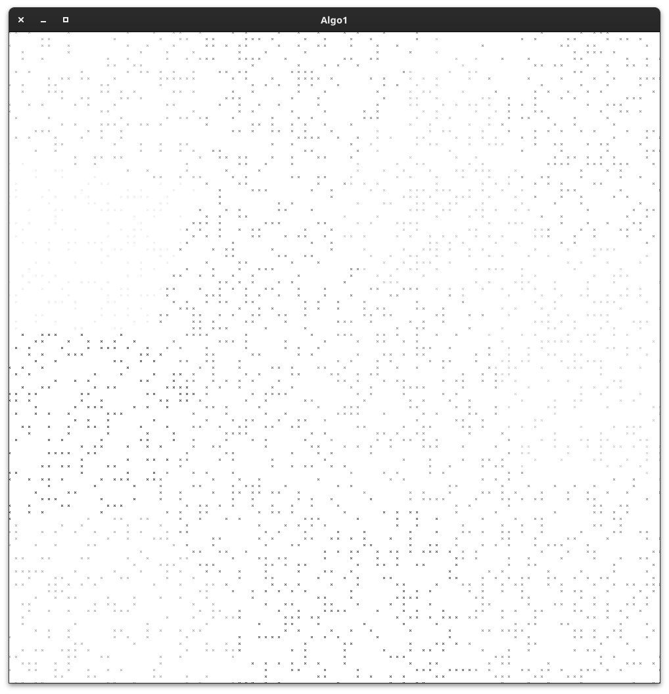
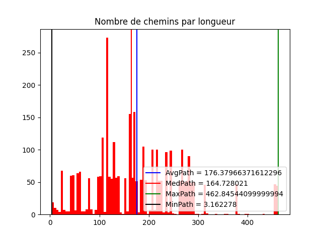

# TIPE - Valentin FOULON - 2023

## Thème du TIPE
La ville

## Sujet
 Comment créer un réseau de transports publics dans une ville afin de minimiser les temps de déplacement ?

## Objectifs
- Mettre en application des algorithmes de graphe et analyser leur efficacité
- Trouver un résultat efficace
- Créer un réseau réaliste
- Avoir une complexité raisonnable (inférieure à $O(n^2)$ )

## Description
Implémentation des algorithmes de Dijkstra, Kruskal, K-moyennes afin de relier des stations

## Compilation des programmes
Requiert ncursesw et SDL2

`make`

## Utilisation des programmes
`./shortestpath.c [fichier_stations]`

`./kruskal.c [fichier_stations]`

`./kavg.c [fichiers_de_sortie [fichier_stations]]`

## Évaluation des résultats fournis par les codes (spé)
Installation des dépendances : `pip install -r requirements.txt`

`python graph.py <fichier_donnees.json>`

## Captures d'écran
shortestpath.c

kruskal.c

kavg.c

kavg.c + kruskal.c

graph.py

