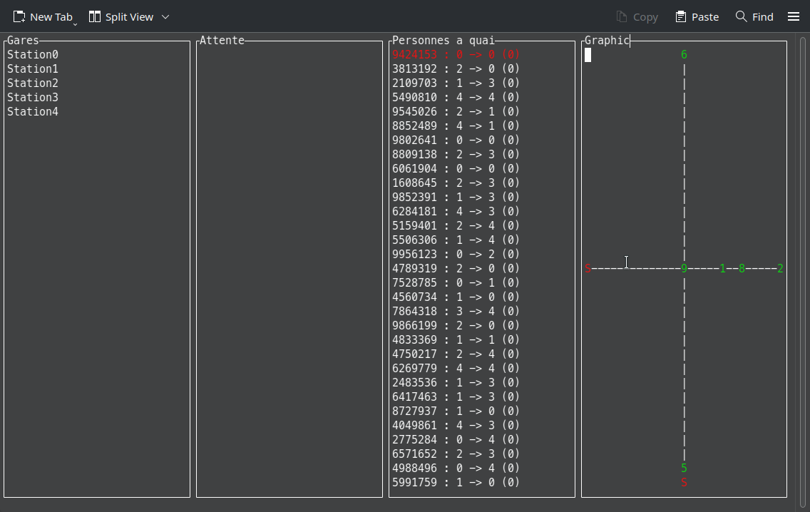
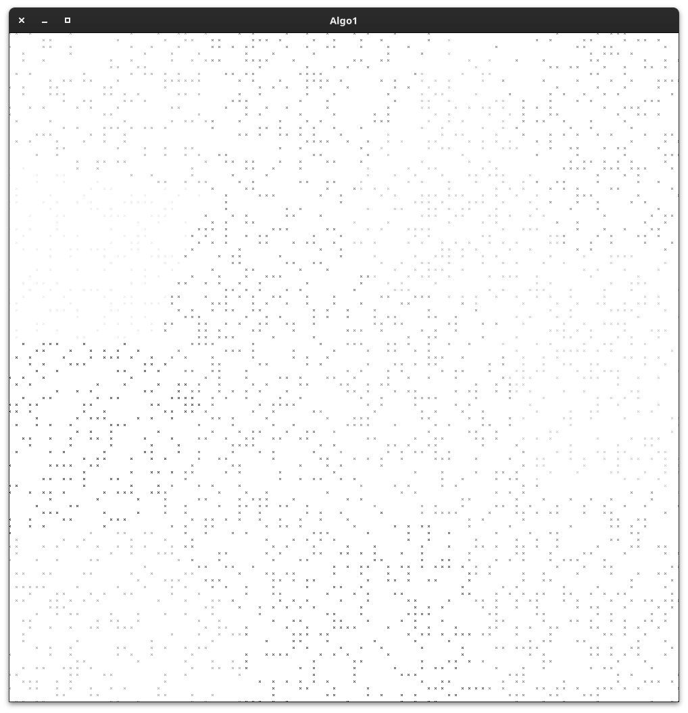
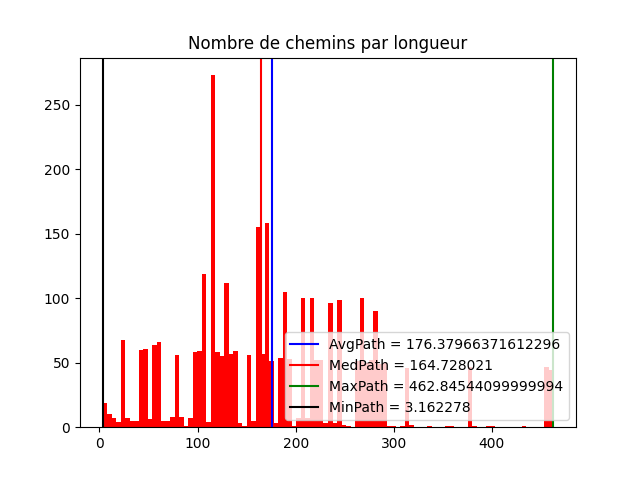

# TIPE - Valentin FOULON - 2023

## Thème du TIPE
La ville

## Sujet
 Comment créer un réseau de transports publics dans une ville afin de minimiser les temps de déplacement ?

## Objectifs
- Mettre en application des algorithmes de graphe et analyser leur efficacité
- Trouver un résultat efficace
- Créer un réseau réaliste
- Avoir une complexité raisonnable (inférieure à $O(n^2)$)

## Description
### Sup
Une représentation graphique du problème avec 5 stations
### Spé
Implémentation des algorithmes de Dijkstra, Kruskal, K-moyennes afin de relier des stations

## Compilation des programmes
### Sup
Requiert ncurses avec le support des caractères longs (ncursesw)

`gcc metro.c -o metro -lm -lncursesw`
### Spé
Requiert ncursesw et SDL2

`make`

## Utilisation des programmes
`./metro [-v]`

`./shortestpath.c [fichier_stations]`

`./kruskal.c [fichier_stations]`

`./kavg.c [fichiers_de_sortie [fichier_stations]]`

## Évaluation des résultats fournis par les codes (spé)
Installation des dépendances : `pip install -r requirements.txt`

`python graph.py <fichier_donnees.json>`

## Captures d'écran
metro.c

shortestpath.c

kruskal.c

kavg.c

kavg + kruskal

graph.py
